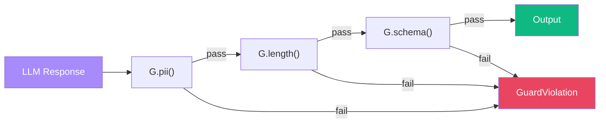

# Guards (G Module)

:::{admonition} At a Glance
:class: tip

- Guards validate and transform LLM output --- PII detection, length limits, schema validation
- Compose with `|`: `G.pii("redact") | G.length(max=500) | G.schema(Model)`
- Compile to `before_model` / `after_model` callbacks automatically
:::



The G module provides a declarative composition surface for safety, validation, and policy guards. Guards compile into ADK `before_model_callback` and `after_model_callback` hooks automatically --- you declare *what* to enforce, not *where* to enforce it.

## Quick Start

```python
from adk_fluent import Agent, G

agent = (
    Agent("safe_agent", "gemini-2.5-flash")
    .instruct("Answer user questions helpfully.")
    .guard(G.json() | G.length(max=500) | G.pii("redact"))
    .build()
)
```

## Design Principle

Each guard answers: **"What must this agent *never* do?"** If you remove the guard, the agent loses safety. Guards belong in G, not M (resilience) or T (capability).

## Guard Types

### Structural Validation

| Guard | Purpose | Phase |
| --- | --- | --- |
| `G.json()` | Validate output is valid JSON | post\_model |
| `G.length(min, max)` | Enforce output length bounds | post\_model |
| `G.regex(pattern, action)` | Block or redact pattern matches | post\_model |
| `G.output(schema)` | Validate output against a schema | post\_model |
| `G.input(schema)` | Validate input against a schema | pre\_model |

### Content Safety

| Guard | Purpose | Phase |
| --- | --- | --- |
| `G.pii(action, detector)` | Detect and redact/block PII | post\_model |
| `G.toxicity(threshold, judge)` | Block toxic content | post\_model |
| `G.topic(deny=[...])` | Block specific topics | post\_model |

### Cost & Rate Policy

| Guard | Purpose | Phase |
| --- | --- | --- |
| `G.budget(max_tokens)` | Enforce token budget | post\_model |
| `G.rate_limit(rpm)` | Enforce requests per minute | pre\_model |
| `G.max_turns(n)` | Limit conversation turns | pre\_model |

### Grounding

| Guard | Purpose | Phase |
| --- | --- | --- |
| `G.grounded(sources_key)` | Verify output is grounded in sources | post\_model |
| `G.hallucination(threshold)` | Detect hallucinated content | post\_model |

### Conditional

| Guard | Purpose |
| --- | --- |
| `G.when(predicate, guard)` | Apply guard only when predicate is true |

## Composition

Guards compose with the `|` operator:

```python
safety = G.pii("redact") | G.toxicity(threshold=0.8) | G.budget(max_tokens=5000)
agent.guard(safety)
```

Each guard in the chain runs independently. The first violation aborts.

## Provider Protocols

Guards that perform detection or judgment delegate to pluggable providers.

### PIIDetector

```python
from adk_fluent._guards import PIIDetector, PIIFinding

class MyDetector:
    async def detect(self, text: str) -> list[PIIFinding]:
        # Your detection logic
        return [PIIFinding(kind="EMAIL", start=0, end=10, confidence=0.95, text="...")]

agent.guard(G.pii("redact", detector=MyDetector()))
```

Built-in detector factories:

- `G.regex_detector(patterns)` — Lightweight regex (dev/test)
- `G.dlp(project)` — Google Cloud DLP (production, requires `google-cloud-dlp`)
- `G.multi(*detectors)` — Union of findings from multiple detectors
- `G.custom(async_fn)` — Wrap any async callable

### ContentJudge

```python
from adk_fluent._guards import ContentJudge, JudgmentResult

class MyJudge:
    async def judge(self, text: str, context: dict | None = None) -> JudgmentResult:
        return JudgmentResult(passed=True, score=0.1, reason="Clean")

agent.guard(G.toxicity(threshold=0.8, judge=MyJudge()))
```

Built-in judge factories:

- `G.llm_judge(model)` — LLM-as-judge (default)
- `G.custom_judge(async_fn)` — Wrap any async callable

## Backwards Compatibility

The legacy callable guard pattern still works:

```python
def my_guard(callback_context, llm_request):
    # Legacy guard function
    return None

agent.guard(my_guard)  # Registers as both before_model and after_model callback
```

## How Guards Compile

Guards have an internal phase that determines where they enforce:

- **pre\_model** guards compile to `before_model_callback`
- **post\_model** guards compile to `after_model_callback`

You never specify the phase — it's determined by the guard type. `G.input()` is pre-model, `G.json()` is post-model, etc.

## IR Integration

Guard specs are preserved on the `AgentNode` IR for diagnostics and contract checking:

```python
ir = agent.to_ir()
print(ir.guard_specs)  # Tuple of GGuard instances
```

## Common Mistakes

::::{grid} 1
:gutter: 3

:::{grid-item-card} Using guards for retry logic
:class-card: sd-border-danger

```python
# ❌ Guards are for safety/validation, not resilience
agent.guard(my_retry_logic)
```

```python
# ✅ Use middleware for retry
pipeline.middleware(M.retry(3))
```
:::

:::{grid-item-card} Mixing guard and callback for the same concern
:class-card: sd-border-danger

```python
# ❌ Redundant --- guard already compiles to after_model
agent.guard(G.length(max=500)).after_model(check_length)
```

```python
# ✅ Use guard alone for validation
agent.guard(G.length(max=500))
```
:::
::::

## Interplay With Other Concepts

| Combines With | To Achieve | Example |
|--------------|-----------|---------|
| [Callbacks](callbacks.md) | Guards compile to callbacks | `.guard(G.pii())` → `after_model_callback` |
| [Middleware](middleware.md) | Guards are per-agent; middleware is pipeline-wide | Guard for PII, middleware for retry |
| [Testing](testing.md) | Verify guards are attached in IR | `assert ir.guard_specs` |
| [Structured Data](structured-data.md) | Schema validation | `G.schema(MyModel)` |

---

:::{seealso}
- {doc}`callbacks` --- low-level before/after hooks
- {doc}`middleware` --- pipeline-wide resilience (retry, circuit breaker)
- {doc}`testing` --- verifying guards in IR
:::

