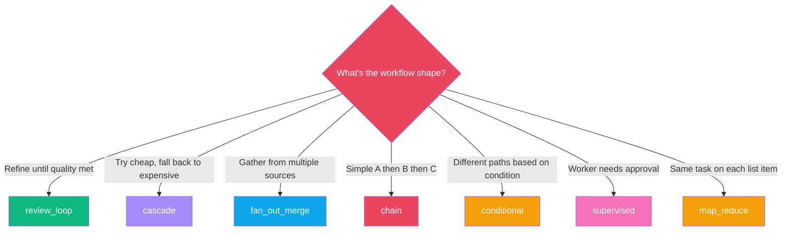
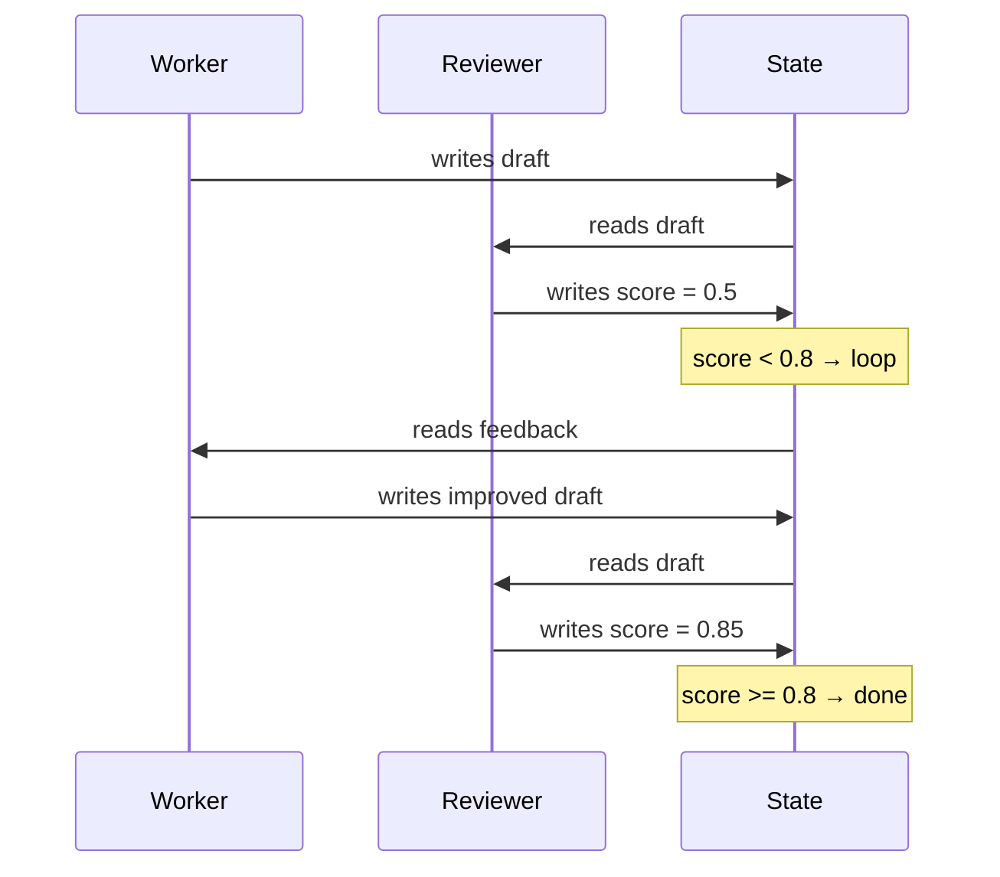
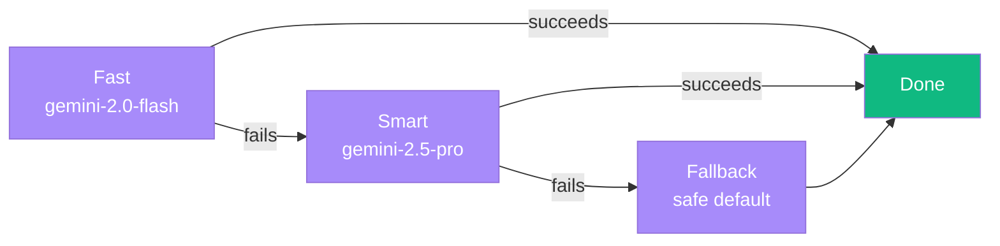
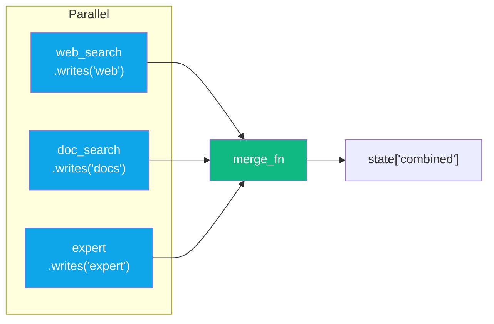
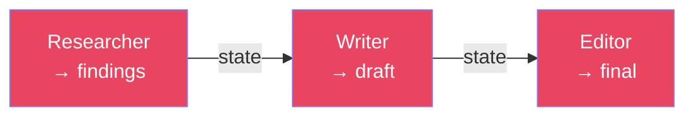
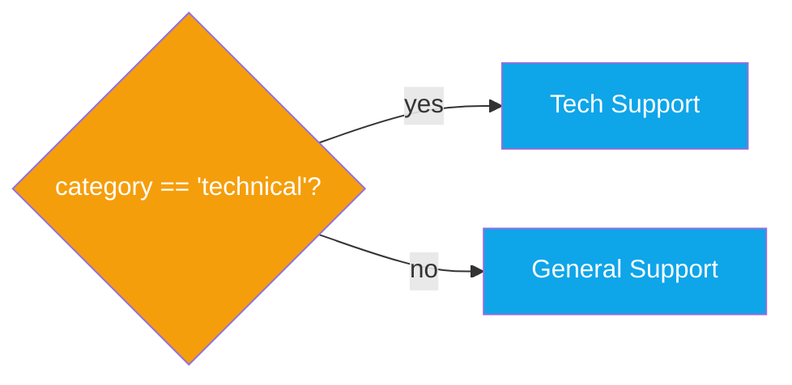
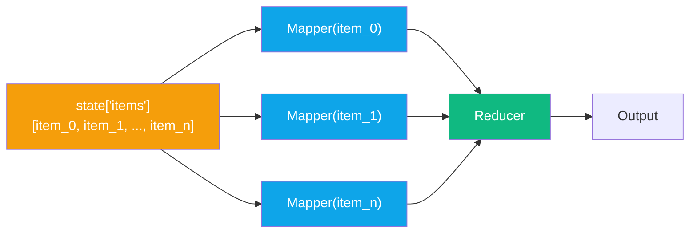

# Composition Patterns

:::{admonition} At a Glance
:class: tip

- Higher-order constructors that compose agents into common architectures
- Each pattern returns a ready-to-use builder --- call `.build()` or chain with `>>`
- All patterns work identically across execution backends (ADK, Temporal, asyncio)
:::

## Pattern Gallery

```mermaid
graph TB
    subgraph "review_loop"
        RL_W["Worker"] --> RL_R["Reviewer"]
        RL_R -.->|"score < target"| RL_W
    end

    subgraph "cascade"
        CA["Fast"] -.->|fail| CB["Strong"] -.->|fail| CC["Fallback"]
    end

    subgraph "fan_out_merge"
        FO_A["Agent A"] --> FO_M["Merge"]
        FO_B["Agent B"] --> FO_M
        FO_C["Agent C"] --> FO_M
    end

    subgraph "map_reduce"
        MR_I["Items"] --> MR_A["Mapper"] --> MR_R["Reducer"]
        MR_I --> MR_B["Mapper"] --> MR_R
    end

    subgraph "conditional"
        CO_P{"Predicate?"} -->|yes| CO_T["Then"]
        CO_P -->|no| CO_F["Else"]
    end

    subgraph "supervised"
        SU_W["Worker"] --> SU_S["Supervisor"]
        SU_S -.->|"revise"| SU_W
    end

    style RL_W fill:#e94560,color:#fff
    style RL_R fill:#0ea5e9,color:#fff
    style CA fill:#a78bfa,color:#fff
    style CB fill:#a78bfa,color:#fff
    style CC fill:#a78bfa,color:#fff
    style FO_A fill:#0ea5e9,color:#fff
    style FO_B fill:#0ea5e9,color:#fff
    style FO_C fill:#0ea5e9,color:#fff
    style FO_M fill:#10b981,color:#fff
    style MR_A fill:#f59e0b,color:#fff
    style MR_B fill:#f59e0b,color:#fff
    style MR_R fill:#10b981,color:#fff
    style SU_W fill:#e94560,color:#fff
    style SU_S fill:#0ea5e9,color:#fff
```



## Pattern Quick Reference

| Pattern | Operator Equivalent | Use Case |
|---------|-------------------|----------|
| `review_loop` | `(worker >> reviewer) * until(...)` | Iterative refinement |
| `cascade` | `a // b // c` | Cost-optimized fallback |
| `fan_out_merge` | `(a \| b) >> S.merge(...)` | Parallel research + combine |
| `chain` | `a >> b >> c` | Sequential with auto-wiring |
| `conditional` | `gate(pred)` + routing | If/else branching |
| `supervised` | `(worker >> supervisor) * until(approved)` | Approval workflows |
| `map_reduce` | `map_over(key) >> reducer` | Process list items |

```python
from adk_fluent.patterns import (
    review_loop, cascade, fan_out_merge,
    chain, conditional, supervised, map_reduce,
)
```

---

## Which Pattern Do I Need?



---

## `review_loop` --- Iterative Refinement

A worker produces output, a reviewer scores it, and the loop repeats until quality meets the target.



```python
pipeline = review_loop(
    worker=Agent("writer").instruct("Write a blog post about {topic}."),
    reviewer=Agent("reviewer").instruct("Score the draft 0-1 for quality."),
    quality_key="review_score",
    target=0.8,
    max_rounds=3,
)
```

| Parameter | Type | Description |
|-----------|------|-------------|
| `worker` | Builder | Agent that produces output |
| `reviewer` | Builder | Agent that scores output |
| `quality_key` | str | State key for the score |
| `target` | float | Score threshold to exit |
| `max_rounds` | int | Safety limit on iterations |

---

## `cascade` --- Fallback Chain

Tries each agent in order. First successful response wins.



```python
pipeline = cascade(
    Agent("fast").model("gemini-2.0-flash"),
    Agent("smart").model("gemini-2.5-pro"),
    Agent("fallback").model("gemini-2.0-flash").instruct("Provide a safe default."),
)
```

:::{tip}
Use cascade for **cost optimization**: try a cheap, fast model first and fall back to expensive models only when needed.
:::

---

## `fan_out_merge` --- Parallel Research + Merge

Run multiple agents in parallel, then merge their outputs.



```python
pipeline = fan_out_merge(
    Agent("web_search").writes("web"),
    Agent("doc_search").writes("docs"),
    Agent("expert").writes("expert"),
    merge_key="combined",
    merge_fn=lambda results: "\n\n".join(results.values()),
)
```

---

## `chain` --- Sequential Composition

Compose a list of steps into a Pipeline with explicit data flow:

```python
pipeline = chain(
    Agent("researcher").writes("findings"),
    Agent("writer").reads("findings").writes("draft"),
    Agent("editor").reads("draft").writes("final"),
)
```



---

## `conditional` --- If/Else Branching

Route to different agents based on a state predicate:



```python
pipeline = conditional(
    predicate=lambda state: state.get("category") == "technical",
    if_true=Agent("tech_support").instruct("Handle technical issue."),
    if_false=Agent("general_support").instruct("Handle general inquiry."),
)
```

---

## `supervised` --- Approval Workflow

A worker produces output, a supervisor approves or requests revisions:

```python
pipeline = supervised(
    worker=Agent("drafter").instruct("Draft the contract."),
    supervisor=Agent("lawyer").instruct("Review for legal compliance."),
    approval_key="approved",
    max_revisions=2,
)
```

Similar to `review_loop` but with approval semantics: the supervisor marks `state[approval_key]` as approved or requests changes.

---

## `map_reduce` --- Fan-Out Over Items

Apply a mapper agent to each item in a list, then reduce results:



```python
pipeline = map_reduce(
    mapper=Agent("analyzer").instruct("Analyze this item: {item}"),
    reducer=Agent("synthesizer").instruct("Synthesize all analyses."),
    items_key="items",
)
```

---

## Patterns vs Operators

When should you use a named pattern vs raw operators?

| Use Pattern When... | Use Operators When... |
|--------------------|-----------------------|
| You want well-tested, named abstractions | You want maximum flexibility |
| You want clear semantic intent | You're doing something custom |
| You want auto-wired data flow | You want explicit control over every detail |
| You're explaining architecture to a team | You're prototyping quickly |

```python
# Pattern: clear intent, auto-wired
pipeline = review_loop(worker, reviewer, quality_key="score", target=0.8)

# Operators: same result, explicit control
pipeline = (worker >> reviewer) * until(lambda s: s.get("score", 0) >= 0.8, max=5)
```

---

## Composability Rules

Patterns nest inside each other and compose with operators:

```python
# review_loop inside a pipeline
pipeline = (
    Agent("classifier").writes("intent")
    >> review_loop(
        worker=Agent("writer"),
        reviewer=Agent("reviewer"),
        quality_key="score",
        target=0.8,
    )
    >> Agent("publisher")
)

# fan_out_merge feeding into a review_loop
pipeline = (
    fan_out_merge(web_agent, docs_agent, merge_key="research")
    >> review_loop(writer, reviewer, quality_key="score", target=0.8)
)
```

---

## Backend Compatibility

All patterns work identically across backends:

::::{tab-set}
:::{tab-item} ADK (default)
```python
pipeline = review_loop(worker, reviewer, quality_key="score", target=0.8)
response = pipeline.ask("Write about AI safety")
```
:::
:::{tab-item} Temporal (in dev)
```python
# Same pattern --- each iteration is checkpointed
pipeline = review_loop(worker, reviewer, quality_key="score", target=0.8)
    .engine("temporal", client=client, task_queue="quality")
response = await pipeline.ask_async("Write about AI safety")
```
:::
::::

---

## Common Mistakes

::::{grid} 1
:gutter: 3

:::{grid-item-card} Using review_loop without `.writes()` on the reviewer
:class-card: sd-border-danger

```python
# ❌ Reviewer doesn't write the score to state
review_loop(
    worker=Agent("writer"),
    reviewer=Agent("reviewer").instruct("Score 0-1."),
    quality_key="score",
    target=0.8,
)
```

```python
# ✅ The pattern handles wiring internally, but ensure your reviewer
# instruction clearly asks for a numeric score in the quality_key
review_loop(
    worker=Agent("writer").instruct("Write a draft."),
    reviewer=Agent("reviewer").instruct("Score the draft 0-1 for quality."),
    quality_key="score",
    target=0.8,
)
```
:::

:::{grid-item-card} Using fan_out_merge with duplicate write keys
:class-card: sd-border-danger

```python
# ❌ Both write to the same key --- last writer wins
fan_out_merge(
    Agent("a").writes("result"),
    Agent("b").writes("result"),
    merge_key="merged",
)
```

```python
# ✅ Each branch writes to a unique key
fan_out_merge(
    Agent("a").writes("a_result"),
    Agent("b").writes("b_result"),
    merge_key="merged",
)
```
:::
::::

---

## Interplay With Other Concepts

| Combines With | To Achieve | Example |
|--------------|-----------|---------|
| [Expression Language](expression-language.md) | Inline operator equivalents | `(a >> b) * until(pred)` instead of `review_loop` |
| [State Transforms](state-transforms.md) | Data cleaning between pattern steps | `fan_out_merge(...) >> S.pick("merged")` |
| [Callbacks](callbacks.md) | Logging each iteration | `review_loop(worker.before_model(log), ...)` |
| [Middleware](middleware.md) | Retry and cost tracking | `.middleware(M.retry() \| M.cost())` |
| [Execution Backends](execution-backends.md) | Durable execution | `.engine("temporal")` |

---

:::{seealso}
- {doc}`expression-language` --- operator equivalents of these patterns
- {doc}`data-flow` --- how state flows through pattern steps
- {doc}`execution-backends` --- backend selection for patterns
- {doc}`temporal-guide` --- durable execution with Temporal
- [Cookbook: Deep Research](../cookbook/hero-workflows/deep-research.md) --- real-world pattern composition
:::
