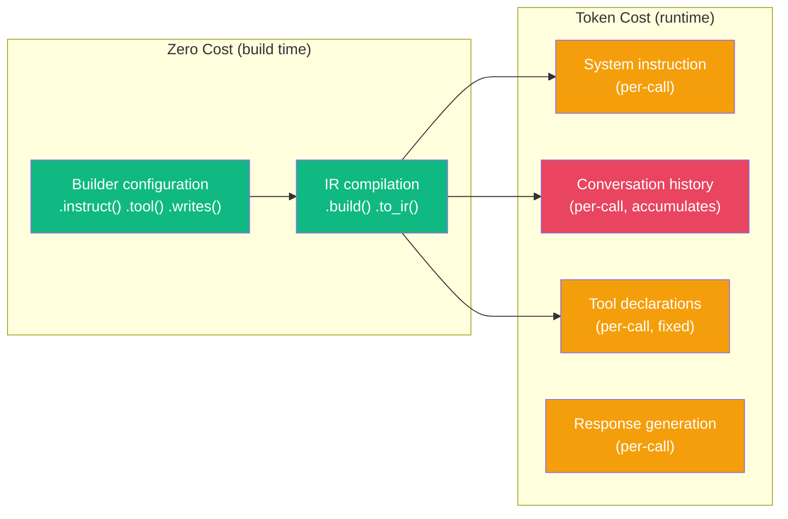

# Performance

:::{admonition} At a Glance
:class: tip

- adk-fluent has zero runtime overhead --- builders exist only at definition time
- Token budgets are the primary cost lever: use `.static()`, `.reads()`, and `C.window()` aggressively
- Use `gemini-2.5-flash` for throughput, `gemini-2.5-pro` for quality-critical steps
:::

## Where Costs Come From



The biggest cost lever is **conversation history**. In a multi-agent pipeline, history accumulates with every step. Without context engineering, downstream agents pay for all upstream agents' output.

---

## Token Budget Strategies

### 1. Use `.static()` for large, stable prompts

```python
# ❌ Sent fresh every call (tokens charged each time)
agent = Agent("editor").instruct(f"Style guide: {fifty_page_guide}\n\nEdit: {{draft}}")

# ✅ Cached by model provider (near-zero per-call cost)
agent = (
    Agent("editor")
    .static(fifty_page_guide)            # Cached
    .instruct("Edit this text: {draft}")  # Sent fresh (small)
)
```

### 2. Suppress irrelevant history with `.reads()` or `C.none()`

```python
# ❌ Classifier sees all prior conversation (wasteful)
classifier = Agent("classify").instruct("Classify intent.")

# ✅ Classifier sees only its instruction (minimal tokens)
classifier = Agent("classify").instruct("Classify intent.").context(C.none())
```

### 3. Window history for long conversations

```python
# ❌ Agent sees entire 50-turn conversation
agent = Agent("helper").instruct("Help the user.")

# ✅ Agent sees only last 3 turns
agent = Agent("helper").instruct("Help the user.").context(C.window(n=3))
```

### 4. Set explicit token budgets

```python
agent = Agent("analyst").context(C.budget(max_tokens=4000)).instruct("Analyze.")
```

---

## Model Selection

| Model | Best For | Cost |
|-------|---------|------|
| `gemini-2.0-flash` | Simple classification, routing | Cheapest |
| `gemini-2.5-flash` | Most tasks, good quality/speed balance | Low |
| `gemini-2.5-pro` | Complex reasoning, quality-critical output | Higher |

### Cascade for cost optimization

Try a cheap model first, fall back to expensive only when needed:

```python
from adk_fluent.patterns import cascade

agent = cascade(
    Agent("fast").model("gemini-2.0-flash").instruct("Answer."),
    Agent("strong").model("gemini-2.5-pro").instruct("Answer thoroughly."),
)
```

---

## Pipeline Optimization

### Use S transforms instead of LLM agents for data manipulation

```python
# ❌ Using an LLM to merge two strings (wasteful)
Agent("merger").instruct("Combine these results: {web} and {papers}")

# ✅ Zero-cost state transform (no LLM call)
S.merge("web", "papers", into="research")
```

### Minimize parallel branch output

```python
# ❌ Each parallel branch writes verbose output
(Agent("a").instruct("Write a full analysis...").writes("a_result")
 | Agent("b").instruct("Write a full analysis...").writes("b_result"))

# ✅ Ask parallel branches to be concise; let the synthesizer expand
(Agent("a").instruct("List key findings in bullet points.").writes("a_result")
 | Agent("b").instruct("List key findings in bullet points.").writes("b_result"))
```

### Use `.isolate()` on specialist agents

```python
# Prevents unnecessary transfers and reduces token overhead
specialist = Agent("math").instruct("Solve math problems.").isolate()
```

---

## Monitoring Token Usage

Use the M module to track costs:

```python
from adk_fluent._middleware import M

pipeline = (Agent("a") >> Agent("b")).middleware(M.cost())
# Logs token usage per agent after execution
```

---

:::{seealso}
- {doc}`context-engineering` --- control what agents see (biggest cost lever)
- {doc}`middleware` --- M.cost() for token tracking
- {doc}`patterns` --- cascade pattern for cost optimization
:::
