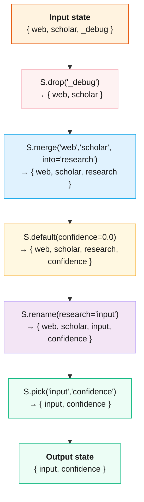

# State Transforms

`S` factories return dict transforms that compose with `>>` as zero-cost workflow nodes. They manipulate session state between agent steps without making LLM calls.



**Composition operators:**

::::{tab-set}
:::{tab-item} Python
:sync: python

```python
S.drop() >> S.merge()         # chain: run in sequence
S.default() + S.rename()      # combine: apply to same state
```
:::
:::{tab-item} TypeScript
:sync: ts

```ts
S.drop().pipe(S.merge_(["a", "b"], "c"));     // chain: run in sequence
S.default_({ k: 1 }).add(S.rename({ a: "b" })); // combine: apply to same state
```
:::
::::

:::{note} TypeScript naming
JavaScript reserves the `default` keyword, so `S.default` becomes `S.default_` and `S.merge` becomes `S.merge_` in TypeScript. The signature also flips: `S.merge_(["a","b"], "into")` takes the keys as an array and the destination as a positional argument.
:::

## Basic Usage

::::{tab-set}
:::{tab-item} Python
:sync: python

```python
from adk_fluent import S

pipeline = (
    (web_agent | scholar_agent)
    >> S.merge("web", "scholar", into="research")
    >> S.default(confidence=0.0)
    >> S.rename(research="input")
    >> writer_agent
)
```
:::
:::{tab-item} TypeScript
:sync: ts

```ts
import { S } from "adk-fluent-ts";

const pipeline = webAgent
  .parallel(scholarAgent)
  .then(S.merge_(["web", "scholar"], "research"))
  .then(S.default_({ confidence: 0.0 }))
  .then(S.rename({ research: "input" }))
  .then(writerAgent);
```
:::
::::

## Transform Reference

| Factory                 | Purpose                  |
| ----------------------- | ------------------------ |
| `S.pick(*keys)`         | Keep only specified keys |
| `S.drop(*keys)`         | Remove specified keys    |
| `S.rename(**kw)`        | Rename keys              |
| `S.default(**kw)`       | Fill missing keys        |
| `S.merge(*keys, into=)` | Combine keys             |
| `S.transform(key, fn)`  | Map a single value       |
| `S.compute(**fns)`      | Derive new keys          |
| `S.guard(pred)`         | Assert invariant         |
| `S.log(*keys)`          | Debug-print              |

## `S.pick(*keys)`

Keep only the specified keys in state, dropping everything else:

::::{tab-set}
:::{tab-item} Python
:sync: python

```python
# After this, state only contains "name" and "email"
pipeline = agent >> S.pick("name", "email") >> next_agent
```
:::
:::{tab-item} TypeScript
:sync: ts

```ts
const pipeline = agent.then(S.pick("name", "email")).then(nextAgent);
```
:::
::::

## `S.drop(*keys)`

Remove the specified keys from state:

::::{tab-set}
:::{tab-item} Python
:sync: python

```python
# Remove temporary/internal keys before the next step
pipeline = agent >> S.drop("_internal", "_debug") >> next_agent
```
:::
:::{tab-item} TypeScript
:sync: ts

```ts
const pipeline = agent.then(S.drop("_internal", "_debug")).then(nextAgent);
```
:::
::::

## `S.rename(...)`

Rename keys in state, mapping old names to new names:

::::{tab-set}
:::{tab-item} Python
:sync: python

```python
# Rename "research" to "input" for the next agent
pipeline = researcher >> S.rename(research="input") >> writer
```
:::
:::{tab-item} TypeScript
:sync: ts

```ts
const pipeline = researcher.then(S.rename({ research: "input" })).then(writer);
```
:::
::::

## `S.default(...)`

Fill in missing keys with default values. Existing keys are not overwritten:

::::{tab-set}
:::{tab-item} Python
:sync: python

```python
# Ensure "confidence" exists with a default of 0.0
pipeline = agent >> S.default(confidence=0.0) >> evaluator
```
:::
:::{tab-item} TypeScript
:sync: ts

```ts
const pipeline = agent.then(S.default_({ confidence: 0.0 })).then(evaluator);
```
:::
::::

## `S.merge(...)`

Combine multiple keys into a single key:

::::{tab-set}
:::{tab-item} Python
:sync: python

```python
# Merge "web" and "scholar" results into "research"
pipeline = (
    (web_agent | scholar_agent)
    >> S.merge("web", "scholar", into="research")
    >> writer
)
```
:::
:::{tab-item} TypeScript
:sync: ts

```ts
const pipeline = webAgent
  .parallel(scholarAgent)
  .then(S.merge_(["web", "scholar"], "research"))
  .then(writer);
```
:::
::::

## `S.transform(key, fn)`

Apply a function to transform a single value in state:

::::{tab-set}
:::{tab-item} Python
:sync: python

```python
# Uppercase the "title" value
pipeline = agent >> S.transform("title", str.upper) >> next_agent
```
:::
:::{tab-item} TypeScript
:sync: ts

```ts
const pipeline = agent
  .then(S.transform("title", (v) => String(v).toUpperCase()))
  .then(nextAgent);
```
:::
::::

## `S.compute(...)`

Derive new keys by applying functions to the state:

::::{tab-set}
:::{tab-item} Python
:sync: python

```python
# Compute a new "summary_length" key from the existing state
pipeline = agent >> S.compute(
    summary_length=lambda s: len(s.get("summary", "")),
    has_citations=lambda s: "cite" in s.get("text", "").lower()
) >> evaluator
```
:::
:::{tab-item} TypeScript
:sync: ts

```ts
const pipeline = agent
  .then(
    S.compute({
      summary_length: (s) => String(s.summary ?? "").length,
      has_citations: (s) => String(s.text ?? "").toLowerCase().includes("cite"),
    }),
  )
  .then(evaluator);
```
:::
::::

## `S.guard(pred)`

Assert an invariant on the state. Raises an error if the predicate fails:

::::{tab-set}
:::{tab-item} Python
:sync: python

```python
# Ensure "data" key is present before proceeding
pipeline = agent >> S.guard(lambda s: "data" in s) >> processor
```
:::
:::{tab-item} TypeScript
:sync: ts

```ts
const pipeline = agent
  .then(S.guard((s) => "data" in s, "missing data key"))
  .then(processor);
```
:::
::::

## `S.log(*keys)`

Debug-print specified keys from state. Useful during development:

::::{tab-set}
:::{tab-item} Python
:sync: python

```python
# Print "web" and "scholar" values for debugging
pipeline = (
    (web_agent | scholar_agent)
    >> S.log("web", "scholar")
    >> S.merge("web", "scholar", into="research")
    >> writer
)
```
:::
:::{tab-item} TypeScript
:sync: ts

```ts
const pipeline = webAgent
  .parallel(scholarAgent)
  .then(S.log("web", "scholar"))
  .then(S.merge_(["web", "scholar"], "research"))
  .then(writer);
```
:::
::::

## STransform Composition

All `S.xxx()` methods return `STransform` objects that support two composition operators:

### Chain (sequential)

::::{tab-set}
:::{tab-item} Python
:sync: python

```python
# Clean state then merge — runs in order
cleanup = S.drop("_internal") >> S.merge("web", "scholar", into="research")
pipeline = agent >> cleanup >> writer
```
:::
:::{tab-item} TypeScript
:sync: ts

```ts
const cleanup = S.drop("_internal").pipe(S.merge_(["web", "scholar"], "research"));
const pipeline = agent.then(cleanup).then(writer);
```
:::
::::

### Combine (parallel)

::::{tab-set}
:::{tab-item} Python
:sync: python

```python
# Apply multiple transforms to the same state at once
setup = S.default(confidence=0.0) + S.rename(research="input")
pipeline = agent >> setup >> writer
```
:::
:::{tab-item} TypeScript
:sync: ts

```ts
const setup = S.default_({ confidence: 0.0 }).add(S.rename({ research: "input" }));
const pipeline = agent.then(setup).then(writer);
```
:::
::::

### Composing with agents

STransform objects work seamlessly in pipelines:

::::{tab-set}
:::{tab-item} Python
:sync: python

```python
# STransform >> Agent works directly
pipeline = S.capture("user_message") >> classifier >> handler
```
:::
:::{tab-item} TypeScript
:sync: ts

```ts
const pipeline = S.capture("user_message").then(classifier).then(handler);
```
:::
::::

### Key tracking

STransforms track which state keys they read and write:

```python
t = S.rename(old="new")
print(t._reads_keys)   # frozenset({'old'})
print(t._writes_keys)  # frozenset({'new'})
```

This metadata powers the contract checker's data-flow analysis.

## Complete Example

The following pipeline demonstrates multiple transforms woven between agents:

```
Complete transform flow:

  ┬─ web ────┐
  └─ scholar ┘  (parallel)
       │
  S.log ──► S.merge ──► S.default ──► S.rename
   debug      combine     fill gaps     rewire
       │
  writer @ Report
       │
  S.guard(confidence > 0)  ── fail? ──► raise
```

::::{tab-set}
:::{tab-item} Python
:sync: python

```python
from pydantic import BaseModel
from adk_fluent import Agent, S, until

class Report(BaseModel):
    title: str
    body: str
    confidence: float

pipeline = (
    (   Agent("web").model("gemini-2.5-flash").instruct("Search web.")
      | Agent("scholar").model("gemini-2.5-flash").instruct("Search papers.")
    )
    >> S.log("web", "scholar")                          # Debug
    >> S.merge("web", "scholar", into="research")       # Combine
    >> S.default(confidence=0.0)                         # Default
    >> S.rename(research="input")                        # Rename
    >> Agent("writer").model("gemini-2.5-flash").instruct("Write.") @ Report
    >> S.guard(lambda s: s.get("confidence", 0) > 0)    # Assert
)
```
:::
:::{tab-item} TypeScript
:sync: ts

```ts
import { Agent, S } from "adk-fluent-ts";

const ReportSchema = {
  type: "object",
  properties: {
    title: { type: "string" },
    body: { type: "string" },
    confidence: { type: "number" },
  },
  required: ["title", "body", "confidence"],
} as const;

const pipeline = new Agent("web", "gemini-2.5-flash")
  .instruct("Search web.")
  .parallel(new Agent("scholar", "gemini-2.5-flash").instruct("Search papers."))
  .then(S.log("web", "scholar"))                                    // Debug
  .then(S.merge_(["web", "scholar"], "research"))                   // Combine
  .then(S.default_({ confidence: 0.0 }))                            // Default
  .then(S.rename({ research: "input" }))                            // Rename
  .then(new Agent("writer", "gemini-2.5-flash").instruct("Write.").outputAs(ReportSchema))
  .then(S.guard((s) => Number(s.confidence ?? 0) > 0, "confidence must be > 0")); // Assert
```
:::
::::
