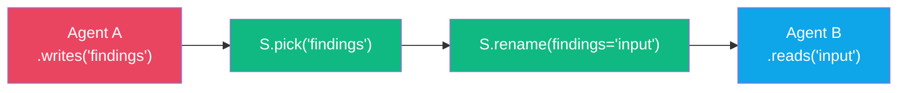
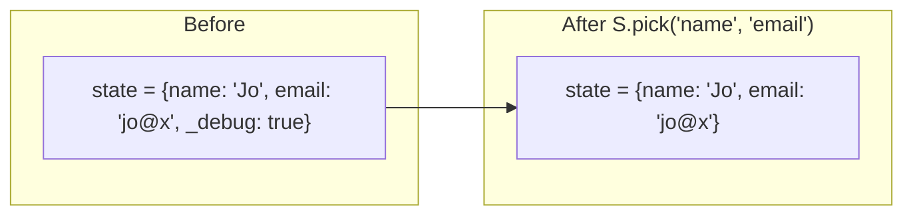
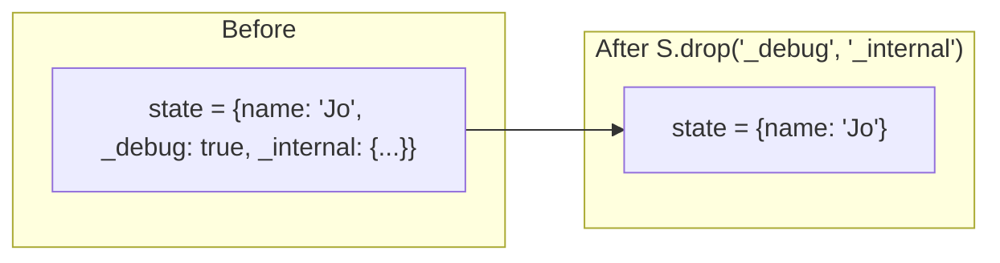
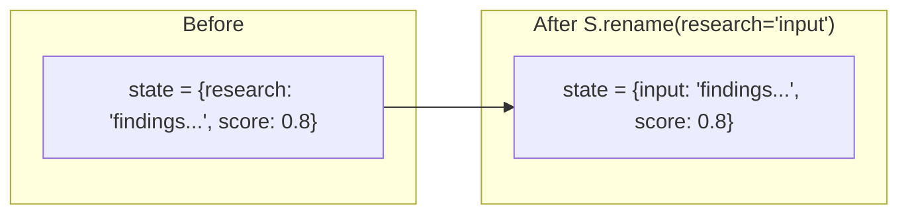
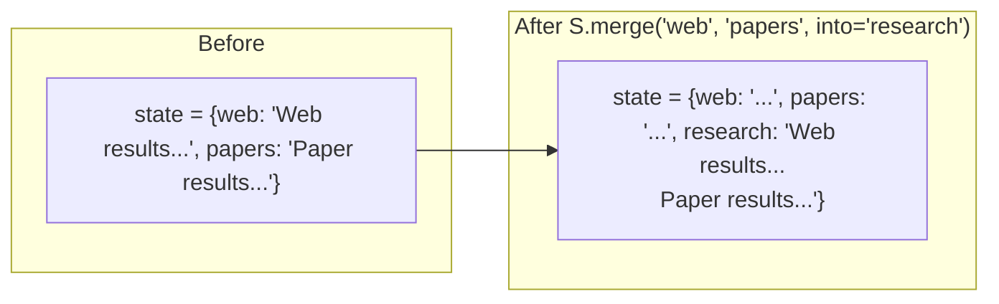
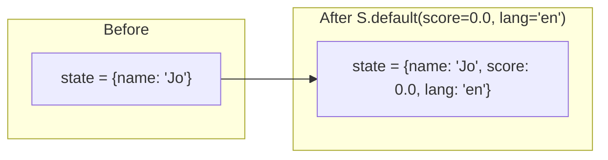
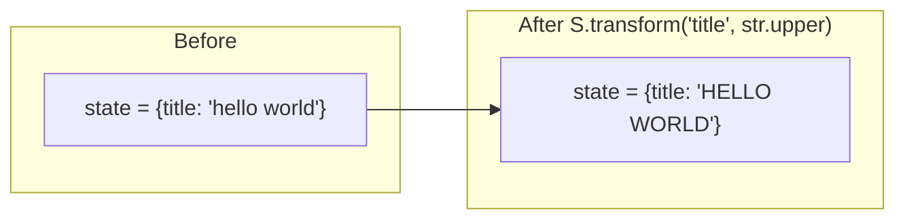
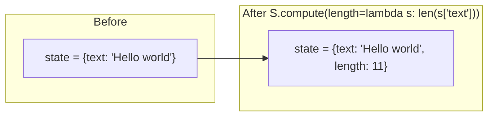
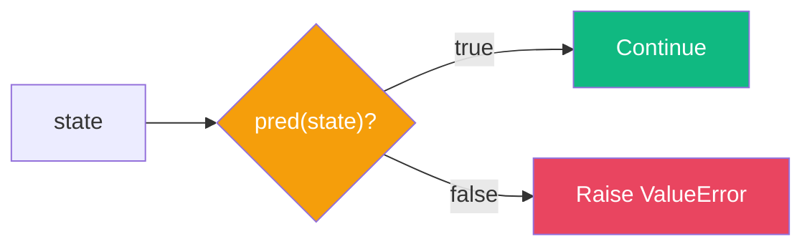
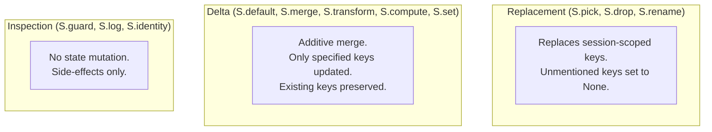

# State Transforms

:::{admonition} At a Glance
:class: tip

- `S` factories return zero-cost dict transforms that compose with `>>` between agent steps
- No LLM calls --- transforms compile to `FnAgent` nodes that manipulate session state directly
- Compose with `>>` (chain sequentially) or `+` (combine on same state)
:::

## How State Transforms Work



S transforms operate exclusively on **session state** (Channel 2). They don't touch conversation history or instruction templating. Each compiles to a `FnAgent` --- zero LLM cost, zero events yielded.

```python
from adk_fluent import Agent, S

pipeline = (
    Agent("researcher").writes("findings")
    >> S.pick("findings")                  # Keep only "findings"
    >> S.rename(findings="input")          # Rename for next agent
    >> S.default(depth="comprehensive")    # Add default value
    >> Agent("writer").reads("input")
)
```

---

## Transform Reference

| Factory | Purpose | Type | Example |
|---------|---------|------|---------|
| `S.pick(*keys)` | Keep only named keys | Replacement | `S.pick("name", "email")` |
| `S.drop(*keys)` | Remove named keys | Replacement | `S.drop("_debug")` |
| `S.rename(**kw)` | Rename keys | Replacement | `S.rename(old="new")` |
| `S.set(**kv)` | Set explicit values | Delta | `S.set(status="ready")` |
| `S.default(**kv)` | Fill missing keys | Delta | `S.default(score=0.0)` |
| `S.merge(*keys, into=)` | Combine keys | Delta | `S.merge("a", "b", into="c")` |
| `S.transform(key, fn)` | Apply function to value | Delta | `S.transform("title", str.upper)` |
| `S.compute(**fns)` | Derive new keys from state | Delta | `S.compute(length=lambda s: len(s["text"]))` |
| `S.guard(pred, msg=)` | Assert invariant | Inspection | `S.guard(lambda s: "data" in s)` |
| `S.log(*keys)` | Debug print to stderr | Inspection | `S.log("web", "docs")` |
| `S.identity()` | No-op pass-through | Inspection | `S.identity()` |
| `S.capture(*keys)` | Capture function args | Delta | `S.capture("user_message")` |

:::{note}
**Replacement** transforms set unmentioned session-scoped keys to `None`. **Delta** transforms only update specified keys, preserving everything else.
:::

---

## Visual Before/After for Each Transform

### `S.pick(*keys)`



### `S.drop(*keys)`



### `S.rename(**mapping)`



### `S.merge(*keys, into=)`



### `S.default(**kv)`



:::{note}
`S.default()` does **not** overwrite existing keys. If `state["score"]` already exists, it's kept as-is.
:::

### `S.transform(key, fn)`



### `S.compute(**factories)`



### `S.guard(pred)`



---

## Replacement vs Delta Transforms



:::{warning}
When mixing Replacement and Delta transforms in a chain, Replacement wins for keys it doesn't mention --- they become `None`. Place Replacement transforms (`S.pick`, `S.drop`) **after** Delta transforms to avoid losing data.
:::

---

## Composition

### `>>` --- Chain (sequential)

```python
# Runs in order: drop → merge → rename
cleanup = S.drop("_internal") >> S.merge("web", "scholar", into="research") >> S.rename(research="input")
pipeline = agent >> cleanup >> writer
```

### `+` --- Combine (parallel)

```python
# Both applied to the same state simultaneously
setup = S.default(confidence=0.0) + S.rename(research="input")
pipeline = agent >> setup >> writer
```

---

## Chaining Transforms: Progressive Example

```python
from adk_fluent import Agent, S

pipeline = (
    (Agent("web").writes("web") | Agent("scholar").writes("scholar"))
    >> S.log("web", "scholar")                            # 1. Debug print
    >> S.drop("_internal", "_debug")                      # 2. Remove internals
    >> S.merge("web", "scholar", into="research")         # 3. Combine sources
    >> S.default(confidence=0.0, format="markdown")       # 4. Fill defaults
    >> S.rename(research="input")                         # 5. Rename for writer
    >> S.pick("input", "confidence", "format")            # 6. Keep only needed keys
    >> Agent("writer").reads("input").writes("draft")
)
```

State at each step:

| Step | Transform | State Keys |
|------|-----------|-----------|
| Start | (after FanOut) | `web, scholar, _internal, _debug` |
| 1 | `S.log` | `web, scholar, _internal, _debug` (unchanged, logs to stderr) |
| 2 | `S.drop` | `web, scholar` |
| 3 | `S.merge` | `web, scholar, research` |
| 4 | `S.default` | `web, scholar, research, confidence, format` |
| 5 | `S.rename` | `web, scholar, input, confidence, format` |
| 6 | `S.pick` | `input, confidence, format` |

---

## Complete Example

```python
from pydantic import BaseModel
from adk_fluent import Agent, S, until

class Report(BaseModel):
    title: str
    body: str
    confidence: float

pipeline = (
    # Parallel research
    (   Agent("web", "gemini-2.5-flash").instruct("Search web.").writes("web")
      | Agent("scholar", "gemini-2.5-flash").instruct("Search papers.").writes("scholar")
    )
    # Transform chain
    >> S.log("web", "scholar")                          # Debug
    >> S.merge("web", "scholar", into="research")       # Combine
    >> S.default(confidence=0.0)                         # Default
    >> S.rename(research="input")                        # Rename
    # Write with schema
    >> Agent("writer", "gemini-2.5-flash").instruct("Write report from {input}.") @ Report
    # Validate
    >> S.guard(lambda s: s.get("confidence", 0) > 0, msg="Confidence must be positive")
)
```

---

## Common Mistakes

::::{grid} 1
:gutter: 3

:::{grid-item-card} Transforming state inside agent instructions
:class-card: sd-border-danger

```python
# ❌ Don't manipulate state in instructions
Agent("helper").instruct("Take the web and scholar results and combine them...")
```

```python
# ✅ Use S transforms for data manipulation --- they're zero-cost
(web | scholar) >> S.merge("web", "scholar", into="research") >> writer
```
:::

:::{grid-item-card} S.pick before S.merge
:class-card: sd-border-danger

```python
# ❌ S.pick removes keys that S.merge needs
agent >> S.pick("web") >> S.merge("web", "scholar", into="research")
# "scholar" is gone!
```

```python
# ✅ Merge first, then pick
agent >> S.merge("web", "scholar", into="research") >> S.pick("research")
```
:::

:::{grid-item-card} Forgetting that S.pick nulls unmentioned keys
:class-card: sd-border-danger

```python
# ❌ Picks "input" but "format" (needed by writer) is now None
agent >> S.pick("input") >> writer  # writer needs {format}
```

```python
# ✅ Include all keys the downstream agent needs
agent >> S.pick("input", "format") >> writer
```
:::
::::

---

## Interplay With Other Concepts

| Combines With | To Achieve | Example |
|--------------|-----------|---------|
| [Expression Language](expression-language.md) | Inline transforms in pipelines | `a >> S.pick("k") >> b` |
| [Data Flow](data-flow.md) | Explicit state contracts | `S.guard(lambda s: "k" in s)` |
| [Context Engineering](context-engineering.md) | Prepare state for `.reads()` | `>> S.rename(old="new") >> agent.reads("new")` |
| [Patterns](patterns.md) | Clean data between pattern steps | `fan_out_merge(...) >> S.pick("merged")` |

---

:::{seealso}
- {doc}`data-flow` --- the five orthogonal data flow concerns
- {doc}`expression-language` --- using S transforms with `>>` operator
- {doc}`context-engineering` --- C module for controlling what agents see
- {doc}`patterns` --- higher-order patterns that use transforms internally
:::
