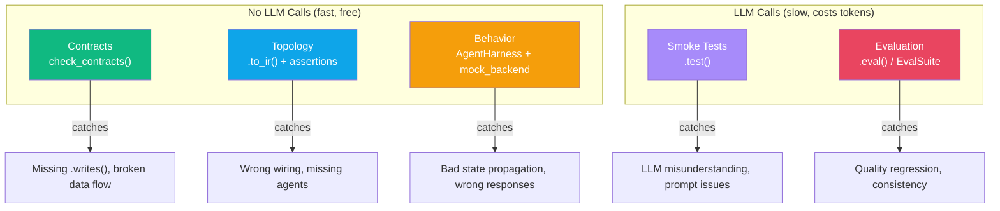
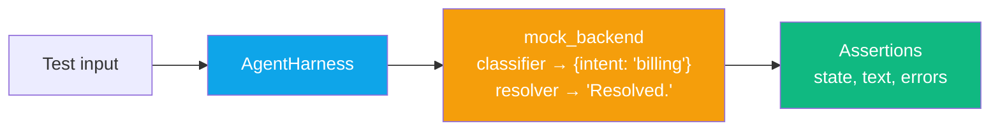

# Testing

:::{admonition} At a Glance
:class: tip

- Test agents without LLM calls using contract checks, IR assertions, and mock backends
- Testing pyramid: contracts (free) → topology (free) → mocks (free) → smoke (LLM) → eval (LLM)
- `check_contracts()` catches the most common bugs at zero cost
:::

## Testing Pyramid



Start from the top. Each layer catches cheaper errors before you burn API tokens.

---

## Testing Methods at a Glance

| Method | LLM? | Speed | What It Tests |
|--------|------|-------|--------------|
| `check_contracts(ir)` | No | Instant | Data flow between agents |
| `.to_ir()` + assertions | No | Instant | Pipeline topology and wiring |
| `AgentHarness` + `mock_backend` | No | Fast | Behavior with canned responses |
| `.test(prompt, contains=)` | Yes | Slow | Basic end-to-end correctness |
| `.mock(responses)` | No | Fast | Replace LLM with canned responses |
| `.eval(prompt, expect=)` | Yes | Slow | Quality scoring |
| `.eval_suite()` | Yes | Slow | Multi-case quality assessment |

---

## Layer 1: Contract Verification

`check_contracts()` inspects the IR tree --- no execution, no API calls --- and verifies that agents satisfy each other's data contracts:

```python
from pydantic import BaseModel
from adk_fluent import Agent
from adk_fluent.testing import check_contracts

class Intent(BaseModel):
    category: str
    confidence: float

# ✅ Valid: classifier produces what resolver consumes
pipeline = Agent("classifier").produces(Intent) >> Agent("resolver").consumes(Intent)
issues = check_contracts(pipeline.to_ir())
assert issues == []

# ❌ Invalid: resolver consumes Intent but nothing produces it
bad_pipeline = Agent("a") >> Agent("resolver").consumes(Intent)
issues = check_contracts(bad_pipeline.to_ir())
# ["Agent 'resolver' consumes key 'category' but no prior step produces it", ...]
```

:::{tip}
Add contract checks to **every** pipeline test. They cost nothing and catch the most common production bugs: renamed state keys and missing data flow.
:::

---

## Layer 2: Topology Assertions

Verify your pipeline has the right shape by inspecting the IR tree:

```python
def test_topology():
    ir = build_my_pipeline().to_ir()
    agent_names = [node.name for node in ir.walk()]
    assert "classifier" in agent_names
    assert "resolver" in agent_names

def test_classifier_context_isolation():
    """Verify classifier doesn't see conversation history."""
    ir = build_my_pipeline().to_ir()
    classifier_node = next(n for n in ir.walk() if n.name == "classifier")
    assert classifier_node.include_contents == "none"
```

---

## Layer 3: Mock Backend

`mock_backend()` creates a backend that returns canned responses for deterministic testing:



```python
from adk_fluent import Agent, C
from adk_fluent.testing import AgentHarness, mock_backend

pipeline = (
    Agent("classifier").instruct("Classify.").context(C.none()).writes("intent")
    >> Agent("resolver").instruct("Resolve {intent}.")
)

harness = AgentHarness(
    pipeline,
    backend=mock_backend({
        "classifier": {"intent": "billing"},          # dict → state delta
        "resolver": "Your billing issue is resolved.", # str → content
    })
)

response = await harness.send("My bill is wrong")
assert response.final_text == "Your billing issue is resolved."
assert response.state.get("intent") == "billing"
```

### Mock Response Types

| Mock Value | Behavior | Use Case |
|-----------|----------|----------|
| `str` | Agent returns this text as content | Simple response assertions |
| `dict` | Agent writes these keys to state | Data flow testing |
| `callable` | Called with `(prompt, state)`, returns `str` or `dict` | Dynamic/conditional responses |

---

## Layer 4: Smoke Tests

`.test()` runs a real LLM call and checks the response:

```python
agent = Agent("helper", "gemini-2.5-flash").instruct("Help with math.")

# Inline smoke test (sync, blocking)
agent.test("What is 2+2?", contains="4")
```

---

## Layer 5: Evaluation

`.eval()` and `EvalSuite` for quality assessment:

```python
# Single evaluation
agent.eval("Summarize quantum physics", expect="mentions superposition")

# Full evaluation suite
suite = agent.eval_suite()
suite.add(E.case("What is 2+2?", expect="4"))
suite.add(E.case("Capital of France?", expect="Paris"))
report = suite.run()
```

:::{seealso}
{doc}`evaluation` for the full E module reference.
:::

---

## pytest Integration

```python
import pytest
from adk_fluent import Agent, C
from adk_fluent.testing import check_contracts, mock_backend, AgentHarness


def test_contracts_satisfied():
    """Contract checks are cheap --- run on every pipeline."""
    pipeline = build_my_pipeline()
    issues = check_contracts(pipeline.to_ir())
    assert not issues, f"Contract violations: {issues}"


def test_topology():
    """Verify the pipeline has the right shape."""
    ir = build_my_pipeline().to_ir()
    agent_names = [node.name for node in ir.walk()]
    assert "classifier" in agent_names
    assert "resolver" in agent_names


@pytest.mark.asyncio
async def test_pipeline_behavior():
    """Behavior test with mock backend."""
    harness = AgentHarness(
        build_my_pipeline(),
        backend=mock_backend({"classifier": {"intent": "billing"}, "resolver": "Resolved."})
    )
    response = await harness.send("test input")
    assert "Resolved" in response.final_text


@pytest.mark.asyncio
async def test_state_propagation():
    """Verify data flows correctly through state keys."""
    harness = AgentHarness(
        build_my_pipeline(),
        backend=mock_backend({
            "classifier": {"intent": "billing"},
            "resolver": "Done.",
        })
    )
    response = await harness.send("test")
    assert response.state.get("intent") == "billing"
```

### Recommended Test Organization

```
tests/
    test_contracts.py       # Contract checks (instant, no API)
    test_topology.py        # IR shape assertions (instant, no API)
    test_behavior.py        # Mock backend tests (fast, no API)
    test_smoke.py           # .test() with real LLM (slow, API key required)
    test_eval.py            # .eval() quality checks (slow, API key required)
```

---

## Common Mistakes

::::{grid} 1
:gutter: 3

:::{grid-item-card} Calling real LLMs in CI
:class-card: sd-border-danger

```python
# ❌ Flaky, slow, costs money
def test_agent():
    result = agent.ask("test")  # Real LLM call in CI!
    assert "hello" in result
```

```python
# ✅ Mock everything in CI
async def test_agent():
    harness = AgentHarness(agent, backend=mock_backend({"helper": "hello"}))
    result = await harness.send("test")
    assert "hello" in result.final_text
```
:::

:::{grid-item-card} Testing only the final response
:class-card: sd-border-danger

```python
# ❌ Doesn't verify data flow --- only checks the end result
assert response.final_text == "Success"
```

```python
# ✅ Also verify intermediate state propagation
assert response.state.get("intent") == "billing"    # State flows correctly
assert response.state.get("resolved") == True         # Intermediate step ran
assert response.final_text == "Success"               # Final output correct
```
:::

:::{grid-item-card} Skipping contract checks
:class-card: sd-border-danger

```python
# ❌ No contract validation --- bugs found at runtime
pipeline = Agent("a").writes("intnt") >> Agent("b").reads("intent")
# "intnt" typo silently causes b to read None
```

```python
# ✅ Contract checks catch typos at build time
issues = check_contracts(pipeline.to_ir())
# ["Agent 'b' consumes 'intent' but no prior step produces it"]
```
:::
::::

---

## Interplay With Other Concepts

| Combines With | To Achieve | Example |
|--------------|-----------|---------|
| [Structured Data](structured-data.md) | Contract annotations for `check_contracts()` | `.produces(Intent).consumes(Intent)` |
| [Context Engineering](context-engineering.md) | Verify context isolation in IR | `assert node.include_contents == "none"` |
| [Guards](guards.md) | Verify guards are attached | `assert ir.guard_specs` |
| [Middleware](middleware.md) | Verify middleware compiled into app | `assert app.plugins` |
| [Evaluation](evaluation.md) | Quality scoring with E module | `.eval_suite()` |

---

## Best Practices

1. **Always test contracts first.** `check_contracts()` is free and catches the most common bugs.
2. **Mock everything in CI.** Never call real LLMs in CI --- use `mock_backend()`.
3. **Test topology, not just behavior.** Assert agents exist, are wired correctly, and have the right context strategy.
4. **Separate fast and slow tests.** Gate `.test()` and `.eval()` behind markers or env vars.
5. **Test state propagation explicitly.** Assert `.writes()` keys appear in downstream state.

---

:::{seealso}
- {doc}`structured-data` --- `.produces()`, `.consumes()`, and contract annotations
- {doc}`context-engineering` --- context isolation and why it matters for testing
- {doc}`guards` --- safety validation with the G module
- {doc}`evaluation` --- quality assessment with the E module
- {doc}`error-reference` --- every error with fix-it examples
:::
